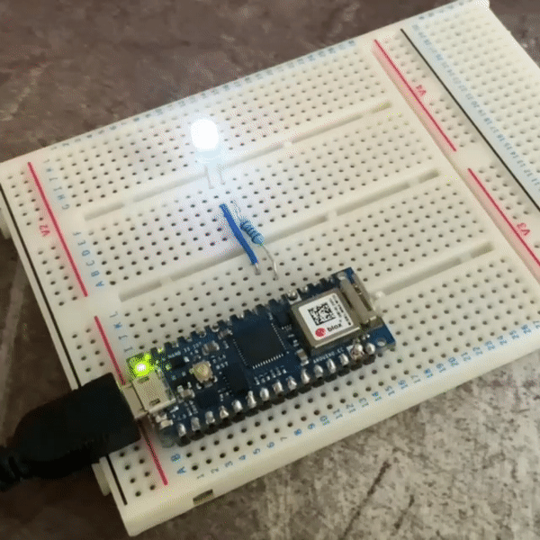


Rust on embedded devices is great.


Embedded Rust makes perfect sense, because embedded software often needs to be bulletproof and Rust can do that while still providing the performance and low-level control that you need from a systems programming language. C and C++ have kind of been the only option for embedded for far too long now, and it's great that there is finally an alternative to segfaults and memory CVEs for embedded developers. I don't have half as much experience with embedded systems as I'd like, but I've played around with Arduino and Raspberry Pi stuff in the past. It's one of those things where I always want to learn/do more, but anything substantial requires hardware and time, two things that I don't have much of.

I'd bought an Arduino Nano 33 IoT, with grand intentions of Yet Another Project which never came to fruition properly. I only really got as far as flashing some Rust code onto it, and using it to blink LEDs and read a few button presses. This was still cool though, because I learned a lot about the whole embedded ecosystem in Rust along the way.

So, when [UWCS](https://uwcs.co.uk) were looking for people to give talks, I thought I might as well take the opportunity do a little Rust evangelism, and also talk a bit about bare metal programming. The whole idea was to introduce Rust, how it works in the embedded domain, and show off the classic LED blinky example. This blog post is an accompaniment to that talk I gave (6 months ago now (I've been busy, okay)). It's on Youtube, and personally, I think it's worth the watch.



## Embedded Rust

[Embedded is a big target for the Rust project](https://www.rust-lang.org/what/embedded), and there is an excellent community working hard to make Rust run on as many things as possible. Microarchitecture crates and peripheral access crates (PACs) provide access to the low-level peripherals in a microcontroller, and then Hardware Abstraction Layers (HALs) provide a, device-agnostic, type-safe, idiomatic, Rusty API over it all. The [Embedded HAL crate](https://github.com/rust-embedded/embedded-hal) provides a set of traits that device-specific HALs then implement. The idea is that people write drivers generic over the traits, and any device that implements the HAL traits can work with the driver.

For example, there's a [trait to represent a digital output pin](https://docs.rs/embedded-hal/latest/embedded_hal/digital/v2/trait.OutputPin.html) which a new microcontroller could implement for its own output pins. Any pre-existing device drivers that use digital output pins would then work for this microcontroller. Traits, Abstraction, Polymorphism. Great stuff.


My Arduino is an [ATSAMD21G](https://www.microchip.com/en-us/product/ATsamd21g18), a neat little 32-bit ARM Cortex-M0+ device with 256kB of flash memory, and 32kB of SRAM, all operating at a blazing-fast 48 MHz.

The [`atsamd-rs`](https://github.com/atsamd-rs/atsamd) repo provides me with a [PAC](https://docs.rs/atsamd21g/latest/atsamd21g/), [HAL](https://github.com/atsamd-rs/atsamd/tree/master/hal), and [specific board support crate](https://github.com/atsamd-rs/atsamd/tree/master/boards/arduino_nano33iot) (BSP) for my board with MCU pins mapped to physical board pins, which made it easy to get started (especially because the blinky example in the repo is also the exact thing I used as a demo).


However, it must be noted that the ecosystem is still young and there isn't support out there for all devices yet. I chose this board because I knew ARM architectures had good support in Rust and that there was crates out there for it already. As an example, Rust doesn't support Espressif's Xtensa-based ESP32 and ESP8266 chips, and there's custom forks of both [LLVM](https://github.com/espressif/llvm-project) and [Rust](https://github.com/esp-rs/rust) that have to be used to work with those. It's also often the case that there's no PAC/HAL/BSP for a board you want to use, in which case you're stuck having to make your own with whatever is already out there. BSPs build on HALs build on PACs, so your mileage with existing support can vary.

## Bare Metal

Writing Rust for microcontrollers means you're running in a bare-metal environment: no operating system. Your code is the only thing running on that CPU, which means theres a few things to consider:

- You can't link to Rust's standard library, because much of the code there assumes the presence of an operating system, a luxury we do not have in this case. The `#![no_std]` attribute tells the compiler not to link the `std` crate in.
- You need a panic handler to tell Rust what to do in case of a panic. Without the standard library, this behaviour must be defined explicitly.
- The [`cortex_m_rt`](https://github.com/rust-embedded/cortex-m/tree/master/cortex-m-rt) crate provides minimal startup code and a runtime for ARM Cortex-based devices, which is linked in by including it in the package manifest. It takes care of few micro-architecture specific things, such as declaring the entry point of the program and populating the device's vector table.
- You need to cross-compile for the target architecture, which is done by specifying the Arduino's target triple (`thumbv6m-none-eabi`) in `.cargo/config`.

Having to deal with all this would usually be deemed a faff, and rightfully so, but it's interesting to me: it's the kind of code I enjoy writing and it appeals to the engineer in me. Working directly on the metal exposes a bunch of interesting details about how CPUs and computer systems actually work, making you take care of all the things that most programmers can 99% of the time take for granted, and giving you a deeper understanding of the usually invisible details. Systems programming is cool 😎

## Blinky

[One Github repo later](https://github.com/Joeyh021/arduino-blinky), and the LED I wired up (electronics engineer btw) to pin 10 is blinking. Riveting stuff.



You can watch the video if you want a full walkthrough of the code and how it all works (except for the bit at the end where it doesn't work because I missed a line from my linker script and forgot to declare one of my variables mutable (the old curse of live demos)), but I wanted to talk in more detail about some bits I found interesting.

### Panics

Rust has certain symbols which must exist in binaries, known as [lang items](https://doc.rust-lang.org/beta/unstable-book/language-features/lang-items.html). Usually you needn't worry about these, but there's some that are defined in the standard library, most notably `panic_impl`, that the compiler won't compile without. We need our own panic handler, which we use from the [`panic_halt`](https://github.com/korken89/panic-halt) crate. It contains a single function marked with the `#[panic_handler]` attribute:

```rust
#[panic_handler]
fn panic(_info: &PanicInfo) -> ! {
    loop {
        atomic::compiler_fence(Ordering::SeqCst);
    }
}
```

The functions take a reference to a `PanicInfo` struct (because it has to), and then just loops infinitely. The `atomic::compiler_fence(Ordering::SeqCst)` call tells the compiler that all code after it must obey [sequential consistency rules](https://doc.rust-lang.org/nomicon/atomics.html#sequentially-consistent), which stops the compiler doing any reordering of instructions after this function is called, because it would be bad if something was reordered to execute after our panic handler.

The line `use panic_halt as _` puts the function into the program, but since it is never called or interacted with manually, it's not bound to a name. It's just there, lurking in the binary to take care of things when I inevitably fuck up.

### Linkers

Linker scripts are something else we need to get into that aren't usually an issue. In `.cargo/config.toml`, we specify two `rustc` arguments:

- `link-arg=-Tlink.x` tells the linker to use the `link.x` script included with `cortex_m_rt`, which ensures that our program has all the right sections in its binary and is laid out in memory correctly for the Cortex-M architecture.
- `link-arg=-nmagic` tells the linker explicitly to disable page alignment of output sections. There's nothing as fancy as memory paging going on on this little Arduino, and the linker trying to align things to page boundaries moves sections in a way that confuses some flashing tools. Which is bad, because you could accidentally end up overwriting the Arduino's bootloader. Very bad.

There's a simple linker script `memory.x` in the root of the cargo project too that's specific to our board and describes its address space:

```
MEMORY
{
  FLASH (rx) : ORIGIN = 0x00000000+0x2000, LENGTH = 0x00040000-0x2000 /* bootloader 8kb */
  RAM (rwx) : ORIGIN = 0x20000000, LENGTH = 0x00008000
}
```

We're telling the linker that the board's flash is read and execute only (`rx` permissions), starts at `0x200`, and is `0x40000 `(256kB) long. The 8kB offset is to account for the bootloader that we, again, _do not want to overwrite_. The RAM starts at address `0x20000000` and is 32kB long, with `rwx` permissions (because that's what RAM is for).

### Peripherals and Ownership

Rust doesn't like global mutable state (for obvious reasons), so working with peripherals in embedded systems i.e., one big global mutable state, is an interesting problem to model. [The Embedded Book](https://docs.rust-embedded.org/book/peripherals/index.html) does a better job of explaining this than I will, but the idea is that peripherals are singletons. Only one instance of a singleton peripheral type can exist at any time, and that you must have ownership of a peripheral to work with it.

The distinction Rust provides at compile time between mutable and immutable state keeps track of what registers are changing and what peripherals are modifying which values, and allows the compiler reason about what you're doing with your hardware. The state and configuration of peripheral interfaces can also be modelled on the type level to guarantee safety, that you aren't doing something silly like reading from an output pin. These kind of static guarantees don't exist in C/C++, and remove most of the common foot-guns you find in embedded programming, making your life _much_ easier (in return for having to deal with the borrow checker, that is).

If you look at the example code, there's a bunch of let bindings in `main` that just seem like dumb boilerplate, but they're actually really important because we're taking ownership of and initialising all the peripherals that the program needs to blink the LED.

## Conclusion

I hope you enjoyed my ramblings on my brief misadventures into embedded Rust. I hope that I'll eventually get round to doing something substantial and (maybe even cool) with in in future. If you want to read more, the [Embedded](https://docs.rust-embedded.org/book/intro/index.html) and [Discovery](https://docs.rust-embedded.org/discovery/) books are both excellent to work through. As always, the best way to get the hang of something is to try it, so pick up a board and blink some LEDs on it. It's way more exciting than it sounds, I promise.
