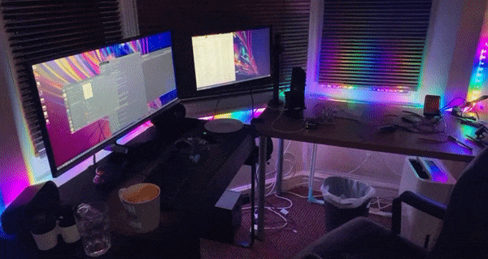
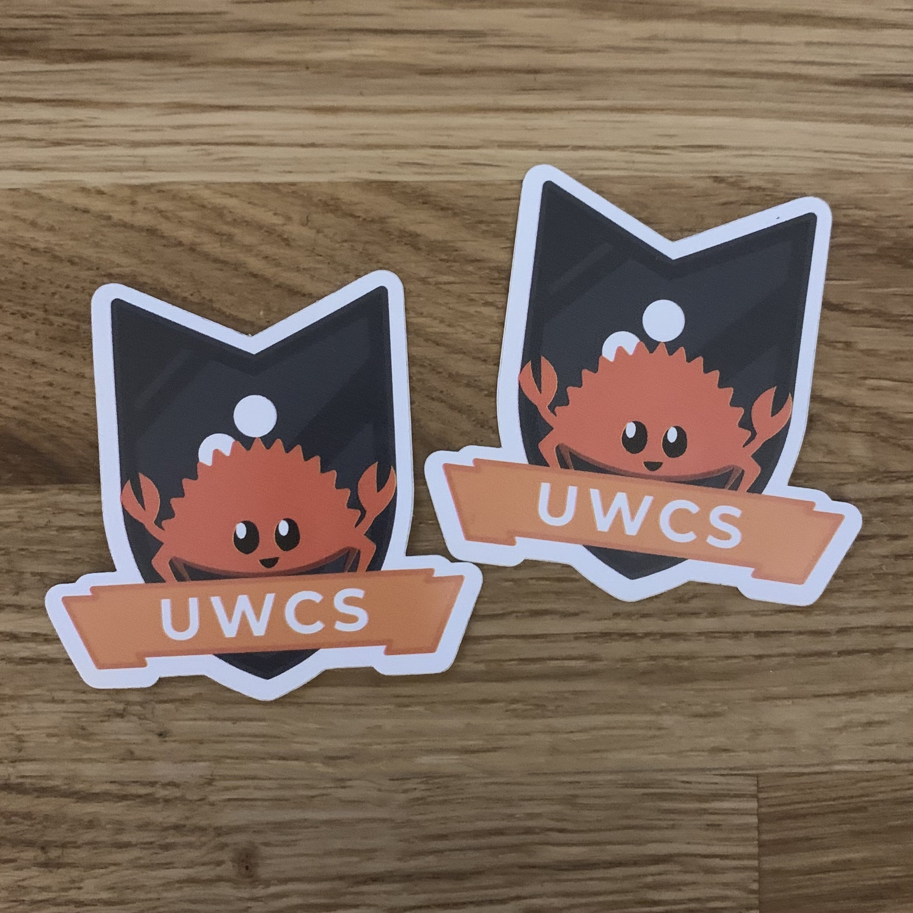
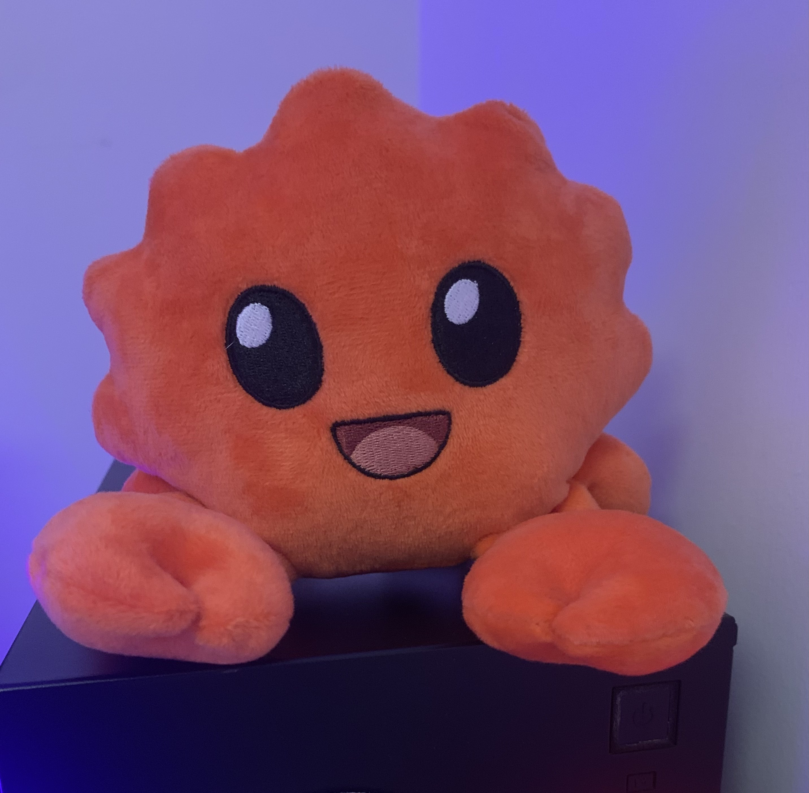

My journey with Rust started in early 2021. I’d spent my first term of uni learning[^1] C and had produced [a nano clone](https://github.com/joeyh021/kin) as part of a coursework for which the brief was “write a text editor in C”. Writing C was fun in the way that you get to work with the computer on a lower level, but sometimes it can also be fun in the way that waterboarding is, so I was looking for something better. Enter Rust.

[^1]: I already knew C: I read K&R during 6th form and wrote [a clone of the fallout terminal hacking game](https://github.com/Joeyh021/FalloutTerminalGame)

There were two main resources I learned from. [The Book](https://doc.rust-lang.org/stable/book/) remains one of the best programming language tutorial documents I’ve read. The other was [Learn Rust With Entirely Too Many Linked Lists](https://rust-unofficial.github.io/too-many-lists/#learn-rust-with-entirely-too-many-linked-lists), an excellent tutorial that takes you from the very basics all the way to advanced borrow checking and unsafe stuff, as well as one of the best (imo) explanations of how iterators work and are designed in Rust.

The first big project I wrote independently was [PATP](https://github.com/joeyh021/patp). The Pedagogically Advanced Teaching Processor is a very simple hypothetical microprocessor that was designed for teaching computer architecture at Warwick. It’s hypothetical in the sense that there is no actual PATP hardware: just an instruction set architecture and a high level block design of how one may design digital hardware for such an ISA. I took steps towards making it less hypothetical by writing an assembler and emulator for it, in Rust.

This was a good first project because it was a good balance between enough complexity to explore lots of different bits of rust, and simple enough it won’t scare me off or give me a headache. Writing a parser for the assembly language, an internal representation of the instruction set, and a function to execute a list of instructions against a model of the CPU are all problems that can be solved very elegantly in Rust[^2]. It was then used for teaching the following year the course was ran, which both helped the students further explore computer architecture and get some exposure to Rust, something I’m really proud of.

[^2]: Just because they _can_ be solved elegantly doesn't mean my solutions were/are. The parser, especially, is dog shit. I got halfway through rewriting it at one point using parser combinators but gave up.

Since then I’ve just been building bits and bobs, because I enjoy building things. I think the 2nd thing I built was a controller and web app for a WS2812 LED strip connected to a Raspberry Pi. This one lasted about 3 days until the electronics I’d lazily janked together for it blew up and I never got round to replacing them. Me and some friends won “Most Creative” at a hackathon for [OOLANG](https://github.com/RNM-enterprises/oolang), a stack-based esoteric programming language where each instruction is some O-shaped unicode character. I’ve also written some stuff for [UWCS](https://uwcs.co.uk/)[^3] that runs in production and is actually used by people: a new package manager for downloading games from our servers onto the the PCs in the CS labs (the old one was a 10-year old 1200 line PHP script), and https://go.uwcs.uk, a URL shortener service.

[^3]: [The University of Warwick Computing Society](https://uwcs.co.uk/). I was Treasurer from April 2022 - May 2023, and remain part of [Tech Team](https://techteam.uwcs.co.uk/).

Despite all this, my favourite thing I’ve done with Rust is share it with other people. Instead of revising for my 2nd year exams, I started plotting. I’d become A Rust Guy, and wanted to share this thing I was so excited about with other people. I started writing what would eventually become RS118[^4]: a short course designed to introduce people to Rust, including three lectures and two tutorials for extended projects (a CHIP-8 interpreter and a raytracer from scratch). I ran RS118 with UWCS in Autumn 2022, and it went down a treat. It was fairly (50+ people) well attended, and succeeded in it’s goal of getting other people excited about Rust. In hindsight, the projects were perhaps a bit ambitious (I don’t think many people got very far with the raytracer), but plenty of people succeeded in building their own CHIP-8 interpreters after my 3 short lectures. We even succeeded in receiving some sponsorship from The Rust Foundation for it as part of their community grants program, which bought everyone pizza for each of the sessions, as well as some really cool UWCS X Ferris stickers which we gave away.

[^4]: CS118 is the intro to programming in Java course at Warwick.

We also do lightning talks at UWCS, which are great because you get to hear from the student community at Warwick about a bunch of different topics. [They’re all on Youtube](https://www.youtube.com/watch?v=OC5D6DD1-_w&list=PLM7py5yAB4FxS3FzpBD4BA29M6Ue5qyVe), and I’d recommend checking any out that pique your interest. Of course I had to do a Rust one, so I did 20 minutes on [embedded systems programming in Rust](https://www.youtube.com/watch?v=-6nDuX_jMBw&list=PLM7py5yAB4FwkpSQaONXwgAJPwJamumLo), including an overview of how Rust makes embedded software much less painful, and what a simple LED blink looks like. Embedded is somewhere I see huge potential for Rust and I’ve got plans[^5] to explore it a lot more in future. We also have a fun thing called [karaoke talks](https://www.youtube.com/watch?v=4pOd7Fk84VA&list=PLM7py5yAB4Fx5BfOdaTI4rRdRt2ZClWsY), where you have to present a set of slides that you’ve never seen before. It inevitably devolves into hilarious chaos, so I tried my hand at that and presented [a talk on Why Rust is Bad, actually](https://www.youtube.com/watch?v=4pOd7Fk84VA). The only thing I knew about this talk beforehand was the title and the fact that I’d be presenting it in half an hour, so the video is a good laugh and certainly worth a watch. The people in the Youtube comments who don’t get the joke are very amusing too.

[^5]: I bought 3 Raspberry Pi Picos and a cool little display module. They're currently sat in a drawer by my desk. We'll see if I ever get round to making a dent in my projects list.

The little Rust community we had built also ended up at [Rust Nation UK 2023](https://www.rustnationuk.com/) - the UK’s first Rust conference. The Rust Foundation had sponsored some tickets for students to attend for free, and I managed to wrangle some for a few lucky UWCS members. The conference day was amazing: The talks, workshops, and people were all great, but my favourite part was probably the Ferris plushies.

It’s been a fun couple of years and I’m incredibly grateful for UWCS: for my friends and the rest of the exec for supporting me in my endeavours, and everyone else who has engaged in any way with my efforts with Rust and everything else over the last couple of years. I graduated from Warwick recently and hope I’ve left something behind that will continue - besides the software that some poor soul is going to have to maintain.

And so I leave you with RS118. It’s not the greatest Rust course ever, but it’s my attempt at getting other people excited about something I’m excited about. Feel free to use for whatever you want (but please give credit where due).

- Main site, including notes for lectures and project tutorials - https://rs118.uwcs.co.uk/
  - mdbook sources are at https://github.com/UWCS/rs118
- [Youtube playlist with lectures](https://youtube.com/playlist?list=PLM7py5yAB4FwxFfwamr9JPVDRKvGDUjvD)
- [CHIP-8 project](https://github.com/UWCS/rs118-chip8)
- [Raytracer project](https://github.com/UWCS/rs118-raytracer)
  - I want to acknowledge that this one is just a rewrite of [Raytracing in One Weekend](https://raytracing.github.io/) from C++ to Rust. Full credit goes to the original authors of that incredible resource.
